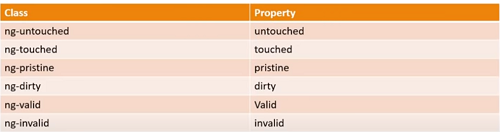

# Angular-Forms

**Angular Forms – Concepts:**

     Component Template: contains the HTML to collect the user data
     Component Class: handles data binding
     Service: sends the collected data to the Server


To achieve this Angular provides two approaches:

1. _Template Driven Forms_  
   – Heavy on the component template  
   – Easy to use and like Angular JS forms
   – Two-way data binding with ngModel  
   – Bulky HTML and minimal code  
   – Automatically tracks the form and form elements state validity  
   – Unit testing is a challenge  
   – Readability decreases with complex forms and validations  
   – Suitable for simple scenarios

2. _Reactive Forms_
   - Heavy on the component class
   - Suitable or unit testing

## Template Driven Forms (TDF)

### Generate a new Project using the Angular CLI

• > ng -v : gives you the installed Angular CLI installed on the machine  
 • > npm install -g @angular/cli@latest : installs the latest Angular CLI version  
 • Generate the project -> Create a Folder navigate inside this folder and run command: >ng new ‘project name’  
 • Navigate inside this folder and run command: > ng serve -o  
 You will see the project up and running  
 • Add Bootstrap styling to the project: getbootstrap.com > Introduction > copy CSS.  
 Go back to VS Code open index.html and add the reference at the end of the head tag.
Check if it works: Go to app.component.html file, delete all html and add a Bootstrap button with the class btn btn-outline-primary; this should display the bootstrap button.  
 <br/>

### Adding the Form

Add the following HTML in the Angular Template  
 • Add div tag of class container fluid `<div class="container-fluid"></div>`  
 • For the topics select create the array in app.component.ts  
 Create a new property (you can delete the default generated title property) - `topics = ['Angular', 'React', 'Vue'];`  
 • Bind the array to a select dropdown in the HTML  
 • To iterrate through the list of topics use the ngForm directive and display the list.  
 • Add a radiobutton group to select the time slot

```HTML
<div class="container-fluid">
  <h1>Form Header</h1>
  <form>
    <div class="form-group">
      <label>Name</label>
      <input type="text" class="form-control" />
    </div>
    <div class="form-group">
      <label>Email</label>
      <input type="email" class="form-control"/>
    </div>
    <div class="form-group">
      <label>Phone</label>
      <input type="tel" class="form-control"/>
    </div>
    <div class="form-group">
      <select class="custom-select">
        <option selected>I am interested in</option>
        <option *ngFor="let topic of topics">{{ topic }}</option>
      </select>
    </div>
    <!--Radio Button-->
    <div class="mb-3">
      <label>Time Preferene</label>
      <div class="form-check">
        <input
          class="form-check-input"
          type="radio"
          name="timePreference"
          value="morning"
        />
        <label class="form-check-label">Morning (9AM - 12PM)</label>
      </div>
      <div class="form-check">
        <input
          class="form-check-input"
          type="radio"
          name="timePreference"
          value="evening"
        />
        <label class="form-check-label">Evening (5PM - 8PM)</label>
      </div>
    </div>
    <!--Check Box Control-->
    <div class="form-check mb-3">
      <input class="form-check-input" type="checkbox"/>
      <label class="form-check-label">Send me promotional offers</label>
    </div>
    <!--Submit Button-->
    <button class="btn btn-outline-primary" type="submit">Submit Form</button>
  </form>
</div>
```

### Binding Data with ngForm

- Import the Angular Forms Module in the app.module.ts file `import { FormsModule } from '@angular/forms';`
- add it to the imports array
  ```TypeScript
    @NgModule({
    declarations: [AppComponent],
    imports: [BrowserModule, FormsModule],
    providers: [],
    bootstrap: [AppComponent],
    })
  ```
- Angular attaches an ngForm directive to the form tag behind the sceen. This provide infromation about this form like, values of the form controls and their validity.  
  To get a reference to the ngForm directive use a template reference variable - `<form #userForm="ngForm">`
- To get access of the values of the form controls use the value property. Here use the values and pass it to the json file - `{{ userForm.value | json }}`
- The form controls that we want to tracked, place in the **`ngModel` directive** - `<input type="text" class="form-control" ngModel />`
- If ngModel is used within a form tag, either the name attribute must be set or the form control must be defined as 'standalone' in ngModelOptions.  
  Add the **`name`** attribute to each of the form controls.
- Angular also provides the `__ngModulGroup__` Directive - to create groups or sub-groups within a form.  
  Group all of the address fields into an address object using the ngModelGroup directive - `<div ngModelGroup="address">` This section is commented out, but here is how it would output the json for this group:  
  `{ "address": { "street": "", "city": "", "state": "", "postalCode": "" }, "userName": "", "email": "", "phone": "", "topic": "", "timePreference": "", "subscribe": "" }`

### Binding Data to a Model

- User enters the data, we capture the changes, and update an instance of the Model, that can later be sent to the server.
- First generate a model class - `ng generate class 'name of class'` - user.ts

```TypeScript
export class User {
  constructor(
    public name: string,
    public email: string,
    public phone: number,
    public topic: string,
    public timePreference: string,
    public subscribe: boolean
  ) {}
}
```

- Create an instance of this model in app.component.ts. Create a userModel property, this will auto import the User

```TypeScript
export class AppComponent {
  topics = ["Angular", "React", "Vue"];

  userModel = new User("Rob", "rob@test.com", 44444444444, "", "morning", true);
}
```

- Now we can bind the userModel data to the form; display the model in json form on the view: `{{ userModel | json }}`
- Bind the properties of the Model to the ngModel directive - for **Property Data Binding** make use of square brackets []. **`[ngModel]="userModel.name"`**. This form of data is **one way data binding - from the class to the view**.  
  We need **Two Way Binding - bind data from the view back to the class**. To achieve that use the banana in the box syntax - [()] for the ngModel directive - **`[(ngModel)]="userModel.name"`**
  Now both the Angular object and the model will reflect the updated values. _With two way binding we always have the model and the view in synch._
- So far we have captured all the form data into a model which can now be sent to the server. However before sending it to the server, it is crucial to perform client side validation and provide useful visiual feedback to the user.

### Validation in Template Driven Forms

#### Track Control State and Validity

Here are the classes that are applied to a Form Control based on its state and validity.  
Angular automatically mirrors many control properties onto the form control element as CSS classes. You can use these classes to style form control elements according to the state of the form. The following classes are currently supported:

```
.ng-valid  ->  the control's value is valid.
.ng-invalid

.ng-touched  ->  the control has been visited.
.ng-untouched

.ng-dirty  ->  the control's value has changed.
.ng-pristine

.ng-pending
```

- add a template reference variable `#name` to the name input and instead of binding to the Form Data, bind to the input's className property -

```HTML
    <div class="form-group">
      <label>Name</label>
      <input
        #name
        type="text"
        class="form-control"
        [(ngModel)]="userModel.name"
        name="userName"
      />
    </div>
    {{ name.className }}
```

Take a look at the browser. The class applied to the input element are displayed - form-control ng-untouched ng-pristine ng-valid. When you play with the input field you can see that these classes will change. These classes can be used to provide visual feedback.

- _ngModel Properties:_  
  Angular also provides alternative associative properties for each of these classes on the ngModel directive.  
  
- Accessing ngModel Properties - create a reference to the ngModel directive. Here `#name`points to the input element in the DOM. By assigning it a value of ngModel - `#name="ngModel"`, the reference variable now points to the ngModel of this particular form control; so we can easily bind to the different properties.  
  For example take a look at the untouched property in the browser - `{{ name.untouched }}`

#### Validation with Visual Feedback

You have two options:

- Create your own class with the necessary styles
- You can use Validation Classes that the CSS framework provides.  
  The class Boostrap provides for invalid state is `is-invalid`, this will display a red border on the control.

  - First get a reference to the ngModel directive (if you don't) - `#name="ngModel"`
  - Use the pattern attribute if you use a pattern `pattern="^\d{10}$"`
  - Bind the invalid class - **Class Binding**. - this will be applied only when the form control is invalid.  
    _Check if is not empty after being touched, it is ok if empty at start-up._

  ```HTML
    <div class="form-group">
      <label>Name</label>
      <input
        #name="ngModel"
        type="text"
        required
        [class.is-invalid]="name.invalid && name.touched"  // (apply class when name control is invalid)
        class="form-control"
        [(ngModel)]="userModel.name"
        name="userName"
      />
    </div>
    {{ name.valid }}
  ```

  _Pattern matching Validation_ - add regex for a pattern

  ```HTLM
      <div class="form-group">
      <label>Phone</label>
      <input
        type="tel"
        #phone="ngModel"
        pattern="^\d{10}$"
        [class.is-invalid]="phone.invalid && phone.touched"
        class="form-control"
        [(ngModel)]="userModel.phone"
        name="phone"
      />
    </div>
  ```
