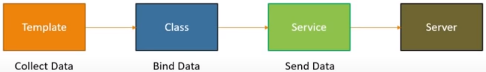

# Angular-Forms

**Angular Forms – Concepts:**

     Component Template: contains the HTML to collect the user data
     Component Class: handles data binding
     Service: sends the collected data to the Server

To achieve this Angular provides two approaches:

1. Template Driven Forms
   – Heavy on the component template  
   – Easy to use and like Angular JS forms
   – Two-way data binding with ngModel  
   – Bulky HTML and minimal code  
   – Automatically tracks the form and form elements state validity  
   – Unit testing is a challenge  
   – Readability decreases with complex forms and validations  
   – Suitable for simple scenarios

2) Reactive Forms
   - Heavy on the component class

- Suitable or unit testing

Template Driven Forms (TDF)

Generate a new Project using the Angular CLI
• > ng -v : gives you the installed Angular CLI installed on the machine
• > npm install -g @angular/cli@latest : installs the latest Angular CLI version
• Generate the project -> Create a Folder navigate inside this folder and run command: > ng new ‘project name’
• Navigate inside this folder and run command: > ng serve -o
You will see the project up and running
• Add Bootstrap styling to the project: getbootstrap.com > Introduction > copy CSS.
Go back to VS Code open index.html and add the reference at the end of the head tag.
Check if it works: Go to app.component.html file, delete all html and add a Bootstrap button with the class btn btn-outline-primary; this should display the bootstrap button.
Add a HTML form
Add the following HTML in the Angular Template

- Add div tag of class container fluid
