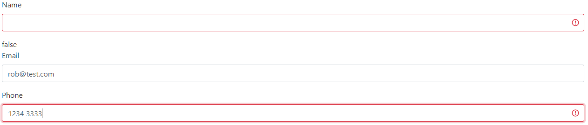
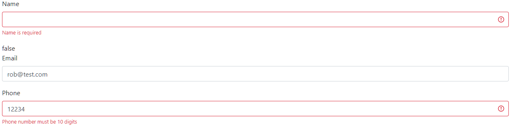
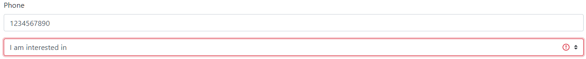
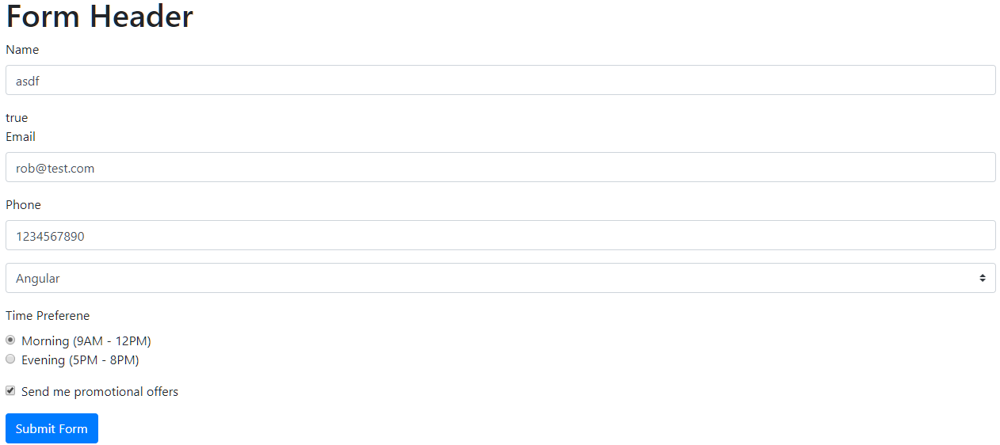
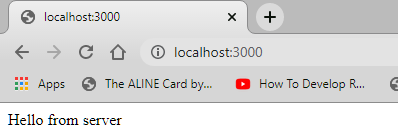
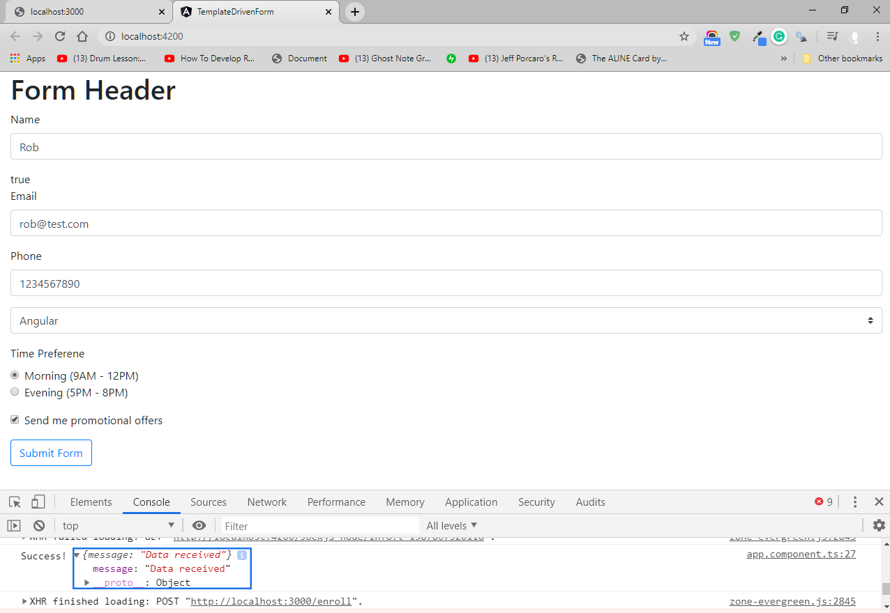
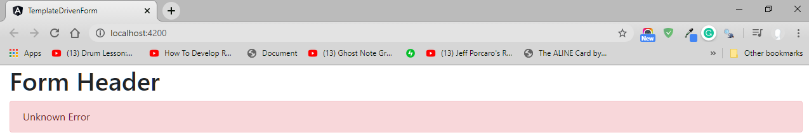

# Angular-Forms

**Angular Forms – Concepts:**

     Component Template: contains the HTML to collect the user data
     Component Class: handles data binding
     Service: sends the collected data to the Server


To achieve this Angular provides two approaches:

1. _Template Driven Forms_  
   – Heavy on the component template  
   – Easy to use and like Angular JS forms
   – Two-way data binding with ngModel  
   – Bulky HTML and minimal code  
   – Automatically tracks the form and form elements state validity  
   – Unit testing is a challenge  
   – Readability decreases with complex forms and validations  
   – Suitable for simple scenarios

2. _Reactive Forms_
   - Heavy on the component class
   - Suitable or unit testing

## Template Driven Forms (TDF)

### Generate a new Project using the Angular CLI

• > ng -v : gives you the installed Angular CLI installed on the machine  
 • > npm install -g @angular/cli@latest : installs the latest Angular CLI version  
 • Generate the project -> Create a Folder navigate inside this folder and run command: >ng new ‘project name’  
 • Navigate inside this folder and run command: > ng serve -o  
 You will see the project up and running  
 • Add Bootstrap styling to the project: getbootstrap.com > Introduction > copy CSS.  
 Go back to VS Code open index.html and add the reference at the end of the head tag.
Check if it works: Go to app.component.html file, delete all html and add a Bootstrap button with the class btn btn-outline-primary; this should display the bootstrap button.  
 <br/>

### Adding the Form

Add the following HTML in the Angular Template  
 • Add div tag of class container fluid `<div class="container-fluid"></div>`  
 • For the topics select create the array in app.component.ts  
 Create a new property (you can delete the default generated title property) - `topics = ['Angular', 'React', 'Vue'];`  
 • Bind the array to a select dropdown in the HTML  
 • To iterrate through the list of topics use the ngForm directive and display the list.  
 • Add a radiobutton group to select the time slot

```HTML
<div class="container-fluid">
  <h1>Form Header</h1>
  <form>
    <div class="form-group">
      <label>Name</label>
      <input type="text" class="form-control" />
    </div>
    <div class="form-group">
      <label>Email</label>
      <input type="email" class="form-control"/>
    </div>
    <div class="form-group">
      <label>Phone</label>
      <input type="tel" class="form-control"/>
    </div>
    <div class="form-group">
      <select class="custom-select">
        <option selected>I am interested in</option>
        <option *ngFor="let topic of topics">{{ topic }}</option>
      </select>
    </div>
    <!--Radio Button-->
    <div class="mb-3">
      <label>Time Preferene</label>
      <div class="form-check">
        <input
          class="form-check-input"
          type="radio"
          name="timePreference"
          value="morning"
        />
        <label class="form-check-label">Morning (9AM - 12PM)</label>
      </div>
      <div class="form-check">
        <input
          class="form-check-input"
          type="radio"
          name="timePreference"
          value="evening"
        />
        <label class="form-check-label">Evening (5PM - 8PM)</label>
      </div>
    </div>
    <!--Check Box Control-->
    <div class="form-check mb-3">
      <input class="form-check-input" type="checkbox"/>
      <label class="form-check-label">Send me promotional offers</label>
    </div>
    <!--Submit Button-->
    <button class="btn btn-outline-primary" type="submit">Submit Form</button>
  </form>
</div>
```

### Binding Data with ngForm

- Import the Angular Forms Module in the app.module.ts file `import { FormsModule } from '@angular/forms';`
- add it to the imports array
  ```TypeScript
    @NgModule({
    declarations: [AppComponent],
    imports: [BrowserModule, FormsModule],
    providers: [],
    bootstrap: [AppComponent],
    })
  ```
- Angular attaches an ngForm directive to the form tag behind the sceen. This provide infromation about this form like, values of the form controls and their validity.  
  To get a reference to the ngForm directive use a template reference variable - `<form #userForm="ngForm">`
- To get access of the values of the form controls use the value property. Here use the values and pass it to the json file - `{{ userForm.value | json }}`
- The form controls that we want to tracked, place in the **`ngModel` directive** - `<input type="text" class="form-control" ngModel />`
- If ngModel is used within a form tag, either the name attribute must be set or the form control must be defined as 'standalone' in ngModelOptions.  
  Add the **`name`** attribute to each of the form controls.
- Angular also provides the `__ngModulGroup__` Directive - to create groups or sub-groups within a form.  
  Group all of the address fields into an address object using the ngModelGroup directive - `<div ngModelGroup="address">` This section is commented out, but here is how it would output the json for this group:  
  `{ "address": { "street": "", "city": "", "state": "", "postalCode": "" }, "userName": "", "email": "", "phone": "", "topic": "", "timePreference": "", "subscribe": "" }`

### Binding Data to a Model

- User enters the data, we capture the changes, and update an instance of the Model, that can later be sent to the server.
- First generate a model class - `ng generate class 'name of class'` - user.ts

```TypeScript
export class User {
  constructor(
    public name: string,
    public email: string,
    public phone: number,
    public topic: string,
    public timePreference: string,
    public subscribe: boolean
  ) {}
}
```

- Create an instance of this model in app.component.ts. Create a userModel property, this will auto import the User

```TypeScript
export class AppComponent {
  topics = ["Angular", "React", "Vue"];

  userModel = new User("Rob", "rob@test.com", 44444444444, "", "morning", true);
}
```

- Now we can bind the userModel data to the form; display the model in json form on the view: `{{ userModel | json }}`
- Bind the properties of the Model to the ngModel directive - for **Property Data Binding** make use of square brackets []. **`[ngModel]="userModel.name"`**. This form of data is **one way data binding - from the class to the view**.  
  We need **Two Way Binding - bind data from the view back to the class**. To achieve that use the banana in the box syntax - [()] for the ngModel directive - **`[(ngModel)]="userModel.name"`**
  Now both the Angular object and the model will reflect the updated values. _With two way binding we always have the model and the view in synch._
- So far we have captured all the form data into a model which can now be sent to the server. However before sending it to the server, it is crucial to perform client side validation and provide useful visiual feedback to the user.

### Validation in Template Driven Forms

#### Track Control State and Validity

Here are the classes that are applied to a Form Control based on its state and validity.  
Angular automatically mirrors many control properties onto the form control element as CSS classes. You can use these classes to style form control elements according to the state of the form. The following classes are currently supported:

```
.ng-valid  ->  the control's value is valid.
.ng-invalid

.ng-touched  ->  the control has been visited.
.ng-untouched

.ng-dirty  ->  the control's value has changed.
.ng-pristine

.ng-pending
```

- add a template reference variable `#name` to the name input and instead of binding to the Form Data, bind to the input's className property -

```HTML
    <div class="form-group">
      <label>Name</label>
      <input
        #name
        type="text"
        class="form-control"
        [(ngModel)]="userModel.name"
        name="userName"
      />
    </div>
    {{ name.className }}
```

Take a look at the browser. The class applied to the input element are displayed - form-control ng-untouched ng-pristine ng-valid. When you play with the input field you can see that these classes will change. These classes can be used to provide visual feedback.

- _ngModel Properties:_  
  Angular also provides alternative associative properties for each of these classes on the ngModel directive.  
  
- Accessing ngModel Properties - create a reference to the ngModel directive. Here `#name`points to the input element in the DOM. By assigning it a value of ngModel - `#name="ngModel"`, the reference variable now points to the ngModel of this particular form control; so we can easily bind to the different properties.  
  For example take a look at the untouched property in the browser - `{{ name.untouched }}`

#### Validation with Visual Feedback

You have two options:

- Create your own class with the necessary styles
- You can use Validation Classes that the CSS framework provides.  
  The class Boostrap provides for invalid state is `is-invalid`, this will display a red border on the control.

  - First get a reference to the ngModel directive (if you don't) - `#name="ngModel"`
  - Add the required attribute and/or the pattern attribute if you use a pattern `pattern="^\d{10}$"`
  - Bind the invalid class - **Class Binding**. - this will be applied only when the form control is invalid. (apply class when name control is invalid)  
    _Check if is not empty after being touched, it is ok if empty at start-up._

    ```HTML
    <div class="form-group">
      <label>Name</label>
      <input
        #name="ngModel"
        type="text"
        required
        [class.is-invalid]="name.invalid && name.touched"
        class="form-control"
        [(ngModel)]="userModel.name"
        name="userName"
      />
    </div>
    {{ name.valid }}
    ```

    _Pattern matching Validation_ - add regex for a pattern

    ```HTML
    <div class="form-group">
      <label>Phone</label>
      <input
        type="tel"
        #phone="ngModel"
        pattern="^\d{10}$"
        [class.is-invalid]="phone.invalid && phone.touched"
        class="form-control"
        [(ngModel)]="userModel.phone"
        name="phone"
      />
    </div>
    ```

    

#### Display Error Messages

Add text as the error message for the a form control in a `<small></small>`tag right after the `<input></input>`tag; and the conditions with the ngModel properties. We can either use _`ngIf`_ or _Class Binding_.

- For Class Binding - `d-none`; to make it appear like an error message use class `text-danger`  
  <small class="text-danger" [class.d-none]="name.valid || name.untouched">Name is required</small>
- Example with two error attributes:
  ```HTML
      <div class="form-group">
      <label>Phone</label>
      <input
        type="tel"
        #phone="ngModel"
        pattern="^\d{10}$"
        required
        [class.is-invalid]="phone.invalid && phone.touched"
        class="form-control"
        [(ngModel)]="userModel.phone"
        name="phone"
      />
      <small class="text-danger" [class.d-none]="phone.valid || phone.untouched">Phone number is required and must be 10 digits</small>
    </div>
  ```
- Use of the Errors property on ngModel - comment out the small tag for the phone and add a `<div></div>`tag that will be conditionally rendered based on whether the phone number field has an error or not. For that use the **`ngIf`directive** along with the ngModel properties.
  ```HTML
      <div class="form-group">
      <label>Phone</label>
      <input
        type="tel"
        #phone="ngModel"
        pattern="^\d{10}$"
        required
        [class.is-invalid]="phone.invalid && phone.touched"
        class="form-control"
        [(ngModel)]="userModel.phone"
        name="phone"
      />
      <!-- <small class="text-danger" [class.d-none]="phone.valid || phone.untouched"
        >Phone number is required and must be 10 digits</small
      > -->
      <div *ngIf="phone.errors && (phone.invalid || phone.touched)">
        <small class="text-danger" *ngIf="phone.errors.required">Phone number is required</small>
        <small class="text-danger" *ngIf="phone.errors.pattern">Phone number must be 10 digits</small>
      </div>
    </div>
  ```
    
  <br/>

#### Select Control Validation

In this example user should select an option other than the default one.

- Add `required` attribute on the `<select>`tag.
- Create a reference to ngModel - `#topic="ngModel"`
- use class binding - `[class.is-invalid]="topic.invalid && topic.touched"`
- add the error message right after the `</select>` tag - `<small class="text-danger" [class.d-none]="topic.valid || topic.untouched">Please choose a topic</small>`  
  This validation only works when the value of default string is empty. If the model passes in a value for the default string, the validation will not work; to fix this use _custom validation_
- **Custom Validation** for the select control - check in the event handler if the value is the default string value; if it is set an error flag to true, and use this flag to display the error message.

* First, the select tag needs binding to blur and change; when they occure we want the `validateTopic(topic.value)` method to be executed; with a passed in value of the select control. `(blur)="validateTopic(topic.value)" (change)="validateTopic(topic.value)"`
* Define the method to set an error flag in app.component.ts

  ```TypeScript
    topicHasError = true;

    validateTopic(value) {
    if (value === "default") {
      this.topicHasError = true;
    } else {
      this.topicHasError = false;
    }
  }
  ```

* use the value of the condition to display the appropriate error message. Change the is-invalid class and the display none class; get rid of the required attribute.
  ```HTML
  <div class="form-group">
    <select
      (blur)="validateTopic(topic.value)"
      (change)="validateTopic(topic.value)"
      #topic="ngModel"
      [class.is-invalid]="topicHasError && topic.touched"
      class="custom-select"
      [(ngModel)]="userModel.topic"
      name="topic"
    >
      <option value="default">I am interested in</option>
      <option *ngFor="let topic of topics">{{ topic }}</option>
    </select>
    <small
      class="text-danger"
      [class.d-none]="!topicHasError || topic.untouched"
      >Please choose a topic</small
    >
  </div>
  ```
  

#### Form Validation

- Form level validation with Angular; instead of individual Form Controls.
- Since Angular attaches the ngForm directive (`ngForm`) automatically to the form tag (`<form>`), we can get a reference to the form tag with the help of a template reference variable (`#useForm`).  
  `<form #userForm="ngForm">`
- The ngModel properties are also availabe on the ngForm directive - `{{userForm.form.invalid}}`.  
  _Example:_ Add _property binding_ to the submit button.  
  Add the disabled property to the submit button and bind it to the invalid state of the form. - **`[disabled]="userForm.form.invalid"`**.  
  This works fine if you don't have custom validation that ngForm is not tracking. In this example though, we have the select control validation.  
  There are a couple of ways to handle this.
- One way is when the button is clicked and an event is fired we could check the value of the field;
- another way is to add another condition to the disabled property. So the submit button gets disalbed when the userForm is invalid or the topic field has an error.

```HTML
    <!--Submit Button-->
    <button
      [disabled]="userForm.form.invalid || topicHasError"
      class="btn btn-outline-primary"
      type="submit">
      Submit Form
    </button>
```



#### Submitting form data

The next step is to how to post the form data to a server - **how to make Http requests.**.

- First add the **`noValidate`\*** attribute on the form tag. This prevents browser validation when clicking the submit button.
- Next, bind to the **`ngSubmit`\*** event, which gets emmitted when the Submit Button is clicked. On the form tag bind to ngSubmit and assign a handler called **`onSubmit()`\***. -  
  `<form #userForm="ngForm" novalidate (ngSubmit)="onSubmit()">`
- Next, define the `onSubmit()` event handler in app.component.ts class

```TypeScript
  onSubmit() {
    console.log(this.userModel);
  }
```

To be able to send this data to a server, we need to make use of a **Service** - `EntrollmentService`. Create a new enrolment-service using the CLI. Navigate inside the project folder and run this command in the terminal - `$ ng g s enrollment`. This will add `CREATE src/app/enrollment.service.ts (139 bytes)`files to the application.

- import into this service - `import { HttpClient } from '@angular/common/http';` and inject it in the constructor:
  ```TypeScript
    export class EnrollmentService {
    constructor(private _http: HttpClient) {}
  }
  ```
- include the **module** in - _app.module.ts_ - `import { HttpClientModule } from "@angular/common/http";`; and add it to the imports array -
  ```TypeScript
    @NgModule({
    declarations: [AppComponent],
    imports: [BrowserModule, FormsModule, HttpClientModule],
    providers: [],
    bootstrap: [AppComponent],
  })
  ```
- in the `EntrollmentService` class add a new property called `_url`, this will be the url to which we post the data.
- create a method `enroll()` that makes the post request. This method will except an argument user of type User, make sure to auto import it;

  - within the body make the post request;
  - the post request will return the response as an **observable**; we need to subscribe to the observable in app.component.ts.  
    Here is the code for the service:

    ```TypeScript
    import { Injectable } from "@angular/core";
    import { HttpClient } from "@angular/common/http";
    import { from } from "rxjs";
    import { User } from "./user";

    @Injectable({
      providedIn: "root",
    })

    export class EnrollmentService {

      _url = "http://localhost:3000/enroll";

      constructor(private _http: HttpClient) {}

      enroll(user: User) {
        return this._http.post<any>(this._url, user);
      }
    }
    ```

- In the app.component.ts file, Import this _EntrollmentService_ and then inject it in the constructor -  
  `import { EnrollmentService } from './enrollment.service';`  
  `constructor(private _enrollmentService: EnrollmentService){}`
- In the `onSubmit()` method, we call the `enroll()` service method, pass in the `userModel`, and then subscribe to the response.

  ```TypeScript
    onSubmit() {
    this._enrollmentService.enroll(this.userModel).subscribe(
      (data) => console.log("Success!", data),
      (error) => console.log("Error!", error)
    );
  }
  ```

  Here is the code for the app.component.ts:

  ```TypeScript
  import { Component } from "@angular/core";
  import { User } from "./user";
  import { EnrollmentService } from "./enrollment.service";

  @Component({
    selector: "app-root",
    templateUrl: "./app.component.html",
    styleUrls: ["./app.component.css"],
  })
  export class AppComponent {
    topics = ["Angular", "React", "Vue"];

    topicHasError = true;

    validateTopic(value) {
      if (value === "default") {
        this.topicHasError = true;
      } else {
        this.topicHasError = false;
      }
    }

    constructor(private _enrollmentService: EnrollmentService) {}

    onSubmit() {
      this._enrollmentService.enroll(this.userModel).subscribe(
        (data) => console.log("Success!", data),
        (error) => console.log("Error!", error)
      );
    }

    userModel = new User(
      "",
      "rob@test.com",
      1234567890,
      "default",
      "morning",
      true
    );
  }
  ```

- Next, we create an Express Server that accepts a post request from the Angular application.

#### Set up Express Server

- This server will receive Form data.
- Create a folder ouside this project called server which contains server code and initialize a new package.json file - `$ npm init --yes`
- next install the dependencies - `$ npm install --save express body-parser cors`; _express_ is our webserver, _body-parser_ is the middleware to handle form data, _cors_ is a package to make requests accross different ports. Here we see the dependencies in the server folder -
  ```JSON
    "dependencies": {
    "body-parser": "^1.19.0",
    "cors": "^2.8.5",
    "express": "^4.17.1"
  }
  ```
- Create a new file called server.js.
- Require the packages that we have just installed.
  ```TypeScript
  const express = require('express');
  const bodyParser = require('body-parser');
  const cors = require('cors');
  ```
- Create a const for the port number the express server is going to run on - `const PORT = 3000;`
- Create an instance of express - `const app = express();`
- Specify body-parser to handle json data - `app.use(bodyParser.json());`
- also use the cors package - `app.use(cors());`
- Add code to test the get request -
- Finally listend to requests on the specified port.
  Here is the final code for the **basic express server**:

```TypeScript
const express = require("express");
const bodyParser = require("body-parser");
const cors = require("cors");

const PORT = 3000;

const app = express();

app.use(bodyParser.json());

app.use(cors());

app.get("/", function (req, res) {
  res.send("Hello from server");
});

app.listen(PORT, function () {
  console.log("Server running on localhost:" + PORT);
});
```

- Run the server; in the terminal type - `$ node server`. Server is running and ready for requests.
- Make the get request in the browser - localhost:3000  
  
- Add an Endpoint to which the Angular application will post data to the Express Server.
  ```TypeScript
    app.post("/enroll", function (req, res) {
    console.log(req.body);
    res.status(200).send({ message: "Data received" });
  });
  ```
- Go back to the Angular application and update the url property in the service - `_url = "http://localhost:3000/enroll";`
- Run the server, make selections in the application(browser) and click Submit Form Button. The server will process and display on console the message.  
  
- When the form is submitted disable the Submit Button; here we will hide the entire form.  
  Inside app.component.ts, add a new property called `submitted` and set the initial value to `false`. - `submitted = false;`
- In the `onSubmit()` method set the value to `true`. - `this.submitted = true;`
- In the HTML to the `<form>` tag add the condition `*ngIf="!submitted"` (only show the form if it has not been submitted). Now when you fill out the form and click the submit button, the form disapears.

#### Error Handling

- The final part for Template Driven Form is Error Handling
- In the EnrollmentService (enrollment.service.js), catch the error from the server and throw it to the subscribed component.  
  To do that we need the help of **_rxjs_**.  
  On the top of the service, import:
  ```TypeScript
  import { throwError } from "rxjs";
  import { catchError } from "rxjs/operators";
  ```
- Catch the Error: - right after the post request, `pipe` the catch operator; and the method to handle (throw) the error (we will name it errorHandler).
  ```TypeScript
    enroll(user: User) {
    return this._http
      .post<any>(this._url, user)
      .pipe(catchError(this.errorHandler));
  }
  ```
- Throw the Error: Throw the error to the component that has subscriped to the service. Define the `errorHandler()` method inside this EnrollmentService class with a parameter of type `HttpErrorResponse`. Make sure this gets auto imported.
  ```TypeScript
    errorHandler(error: HttpErrorResponse) {
    return throwError(error);
  }
  ```
- Now that we are sending the error to the component, display it by bind the _error statusText_ to the View(HTML):
- Create a new property in app.component.ts `errorMsg = '';`
- Assign the error statusText to the errorMsg property -
  ```TypeScript
    onSubmit() {
    this.submitted = true;
    this._enrollmentService.enroll(this.userModel).subscribe(
      (data) => console.log("Success!", data),
      (error) => (this.errorMsg = error.statusText)
    );
  }
  ```
- Bind this message in the HTML - right before the form tag add the following div tag:
  ```HTML
  <div class="alert alert-danger" *ngIf="errorMsg">{{ errorMsg }}</div>
  ```
- In server.js change the response status to 401 (Unauthorized) for the post request.  
  Now run the server; fill out the form and click the Submit Button. We should be able to see this error message on screen:  
  

---
